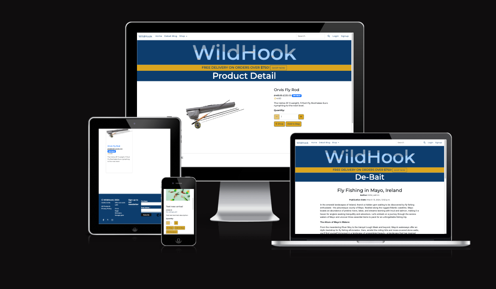

# WildHook
 
Welcome to WildHook, where the thrill of fishing meets the untamed spirit of the great outdoors. We are your premier destination for top-quality fishing tackle and accessories, designed to elevate your angling experience to new heights.

At WildHook, we understand that fishing isn't just a hobby; it's a passion, a way of life. Whether you're an experienced angler seeking the perfect catch or a beginner eager to explore the world of fishing, our brand is here to accompany you on your journey.

Our Vision:
WildHook was born from a love for fishing and a deep appreciation for the wild, rugged landscapes of Ireland and the UK. Our vision is simple yet powerful – to provide you with the tools and knowledge you need to make every fishing trip an unforgettable adventure.

## Table of contents
  * [Overview](#overview)
    + [Business Model](#business-model)
    + [Keyword Research](#keyword-research)
      - [Target Audience](#target-audience)
      - [Brand Focus](#brand-focus)
      - [Keyword Categories](#keyword-categories)
        + [Fishing Tackle](#1-fishing-tackle)
        + [Irish Fishing Keywords](#2-irish-fishing-keywords)
        + [Product Keywords](#3-product-keywords)
        + [Geographical Keywords](#4-geographical-keywords)
        + [Activity Keywords](#5-activity-keywords)
      - [Long-Tail Keywords](#long-tail-keywords)
      - [Competitive Analysis](#competitive-analysis)
      - [Conclusion](#conclusion)
  * [Marketing Strategies](#marketing-strategies)
  * [UX](#ux)
    + [Brand Guidelines](#brand-guidelines)
    + [Scope](#scope)
    + [Structure](#structure)
    + [Wireframes](#wireframes)
    + [Design ](#design)
      - [Color Scheme](#color-scheme)
      - [Fonts](#fonts)
      - [Other](#other)
  * [Agile](#agile)
  * [Features](#features)
    + [Existing Features](#existing-features)
      - [Menu](#menu)
      - [About](#about)
      - [Accounts](#accounts)
      - [Bookings](#bookings)
      - [Booking Management](#booking-management)
    + [Future Feature Considerations](#future-feature-considerations)
  * [Responsive Layout and Design](#responsive-layout-and-design)
  * [Tools Used](#tools-used)
    + [Python packages](#python-packages)
  * [Testing](#testing)
  * [Deployment](#deployment)
    + [Deploy on heroku](#deploy-on-heroku)
  * [Credits](#credits)
    + [Content](#content)
    + [Media](#media)
    + [Code](#code)
  * [Acknowledgements](#acknowledgements)

## Overview
WildHook is an ambitious online platform dedicated to passionate fishing enthusiasts in Ireland and the UK. Combining an intuitive e-commerce interface with rich educational content, we aim to provide a one-stop hub for all things fishing. Users can browse and purchase quality fishing gear, access informative guides and tips, engage with a vibrant fishing community, and streamline their experiences through personalized accounts. With a focus on responsive design and user engagement, WildHook aspires to redefine the online fishing experience, catering to both novice and experienced anglers.
In order to achieve this WildHook has been developed using Python (Django), HTML, CSS and JavaScript PostgreSQL database.
  
The deployed project can be accessed at [here](https://wildhook-72f0fa2bfc47.herokuapp.com/).  

### Business Model
**Business Model Overview:**
WildHook is a B2C-focused e-commerce platform specialising in fishing gear and accessories, catering to fishing enthusiasts in Ireland and the UK. Our mission is to provide a seamless online shopping experience, offering high-quality products, expert advice, and a thriving community hub for anglers of all skill levels.

**Core Business Intents:**

- **Product Excellence:**
   - Source and curate a diverse range of fishing gear, including rods, reels, lures, tackle boxes, and accessories, from reputable brands known for their quality and performance.

- **Customer-Centric Approach:**
   - Prioritise customer satisfaction by offering exceptional customer service, personalised recommendations, and hassle-free returns to build long-term loyalty and trust.

- **Community Engagement:**
   - Foster a vibrant online community where fishing enthusiasts can connect, share experiences, exchange tips, and participate in forum discussions, creating a sense of belonging and camaraderie.

- **Educational Resources:**
   - Provide a comprehensive library of fishing guides, tutorials, tips, and articles to empower customers with knowledge and enhance their fishing skills and experiences.

- **Mobile Accessibility:**
   - Optimise the website for mobile devices, ensuring accessibility and seamless functionality across various platforms to accommodate the mobile-centric behaviour of modern consumers.

### Marketing Strategies:

- **Content Marketing:**
   - Develop high-quality content such as blog posts, videos, and social media posts focused on fishing tips, techniques, and product reviews to attract and engage the target audience.

- **Social Media Engagement:**
   - Leverage social media platforms like Instagram, Facebook, and YouTube to showcase products, share user-generated content, run promotions, and interact with the community.

- **Email Marketing:**
   - Implement targeted email campaigns to deliver personalised product recommendations, exclusive offers, and educational content to subscribers, nurturing relationships and driving sales.

- **Search Engine Optimisation (SEO):**
   - Optimise website content, product listings, and metadata to improve visibility on search engines, driving organic traffic and attracting potential customers actively searching for fishing gear.

- **Partnerships and Influencer Collaborations:**
   - Collaborate with industry influencers, fishing experts, and relevant brands to reach new audiences, gain credibility, and amplify brand awareness through endorsements and sponsored content.

- **Referral Programs:**
   - Implement referral programmes offering incentives for customers to refer friends and family, encouraging word-of-mouth marketing and expanding the customer base organically.

- **Promotions and Discounts:**
   - Run seasonal promotions, discounts, and loyalty rewards programmes to incentivise repeat purchases, increase customer retention, and stimulate sales during peak fishing seasons.

## Keyword Research

### Target Audience:
- Fishing enthusiasts
- Anglers of all skill levels
- Individuals interested in outdoor activities
- Customers in Ireland and the UK

### Brand Focus:
- Fishing tackle and equipment
- Quality products at affordable prices
- Wild, rugged, and adventurous brand image
- Irish roots and heritage

### Keyword Categories:

#### 1. Fishing Tackle:
- Fishing rods
- Fishing reels
- Fishing lures
- Fishing lines
- Fishing hooks
- Fishing tackle boxes
- Fishing accessories

#### 2. Irish Fishing Keywords:
- Fishing in Ireland
- Irish fishing tackle
- Fishing spots in Ireland
- Irish angling gear
- Irish fishing brands
- Wild fishing Ireland

#### 3. Product Keywords:
- Quality fishing tackle
- Affordable fishing gear
- Top fishing brands
- Best fishing equipment
- Fishing gear deals
- Fishing tackle sales

#### 4. Geographical Keywords:
- Fishing tackle UK
- Fishing equipment Ireland
- Fishing gear Dublin
- Tackle shop Belfast
- Fishing supplies Cork
- Angling store Galway

#### 5. Activity Keywords:
- Fly fishing equipment
- Sea fishing gear
- River fishing tackle
- Shore fishing accessories
- Deep sea fishing tackle
- Boat fishing equipment

### Long-Tail Keywords:

1. "Best fishing rods for trout fishing in Ireland"
2. "Affordable sea fishing reels for beginners"
3. "Quality fly fishing lures for wild trout"
4. "Top fishing brands in the UK"
5. "Where to buy fishing tackle near me in Ireland"
6. "Irish-made fishing accessories for sale"
7. "WildHook fishing gear reviews"
8. "Expert tips for river fishing in Ireland"
9. "Irish-themed fishing gifts for anglers"
10. "How to choose the right fishing line for sea fishing"

### Competitive Analysis:

1. Analyze competitors' keywords and their search volumes
2. Identify gaps in competitors' keyword strategies
3. Focus on long-tail keywords specific to WildHook's offerings and brand identity
4. Monitor keyword performance and adjust strategy accordingly

### Conclusion:

By incorporating a diverse range of keywords into WildHook's SEO strategy, we can effectively target the brand's audience while emphasizing its unique selling points and Irish heritage. Regular monitoring and optimization of keyword performance will ensure continued visibility and growth in search engine rankings.

Top 10 key words selected for use: 
+ Fishing tackle
+ Irish fishing tackle
+ Quality fishing tackle
+ Top fishing brands
+ Best fishing equipment
+ Fishing gear deals
+ Fishing tackle sales
+ Fishing spots in Ireland
+ Wild fishing Ireland
+ Fly fishing equipment

## User Stories 
 

|                Sprint              | Number |        User Story          |
| :------------------------------:|---|:-------------------------------------------: |
| **Sprint-1**                               || |
|                                       | #1 | Set Up WildHook Repository - As a Dev I can Use GitHub so that have version control |             
|                                       | #2 | Set up development IDE - As a Dev I can set up an IDE so that the project can be created in a functional workspace|
|                                       |#3| Initialise the project - As a Dev I can initialise the project so that organise the file structure and being building out the app and features|
|                                       |#4| Create & Add Database - As a Dev I can Add a database so that I can store essential Data and access it as required|
|                                       |#5| Create Template, Static & Media directories - As a Dev I can Add directories so that My templates, images and styling is accessible and connected to the app |
|                                       |#6|Test Deployment - As a Dev I can Deploy the project so that I can view and test the project as a user would throughout the project| 
|                                       |#7| Authentication - As a dev I can Install authentication packages so that I can ensure that access is controlled |
|                                       |#8| Bootstrap - As a Dev I can Use tools like bootstrap so that I can manage my time efficiently and create functional web apps with good UI/UX | 
|                                       |#9| Base template - As a Dev I can Create a base template so that I can extend from to prevent verbose code, increase efficiency and have consistent UX/UI |
|**Sprint-2**                        | |  |
|                                       |#10| Home Page - As a dev I can create a home page so that users can land on a page, see their options and choose where they want to navigate to| 
|                                       |#11| Product set up - As a user I can see products so that can order the ones I want|
|                                       |#12|Product Filtering, Sorting and Searching - As a user I can Filter, Sort and Search so that find specific products or categories |
|                                       |#13| Shopping Cart - As a User I can create a cart to save multiple products in while I shop so that I can view, add and update different products | 
|                                       |#14| Updating the Cart - As a user I can adjust the cart so that I can update add or takeaway products from the cart |
|**Sprint-3**                        | |  |
|                                       |#15| Checkout - As a user I can use a checkout feature so that I can pay securely and safely for my products |
|                                       |#16| Integrate Stripe - As a Owner I can integrate stripe so that payments can be managed automatically and securely |
|                                       |#17| Profiles - As a User/Owner/Dev I can Sign in to my account so that access a relevant amount of information for my access |
|                                       |#18| Product Management - As a Owner I can Create, Update and Delete Products so that manage my store effectively |
|**Sprint-4**                        | |  |
|                                       |#19| Stripe Account set-up - As a Dev/Owner I can create a Stripe account so that I can manage online payments |
|                                       |#20| Stripe Integration - As a Dev I can integrate stripe so that secure payments can be taken |
|                                       |#21| Checkout Styling - As a Dev I can edit and Update stripes standard payment gateway so that secure payments are processed, with a UI/UX inline with the brands guidelines |
|                                       |#22| Checkout testing - As a Dev I can test the checkout so that i can confirm that secure payments are being processed |
|                                       |#23| Project review - As a Dev I can review the project so that I can ensure all the features are satisfactory and the UX/UI is to requirements. Add any new features that may have been added with the Agile approach, plan and implement them. |
|**Sprint-5**                     | | TBC |
|                                       ||  |

### Goal 
 
WildHook was born from a love for fishing and a deep appreciation for the wild, rugged landscapes of Ireland and the UK. Our vision is simple yet powerful – to provide you with the tools and knowledge you need to make every fishing trip an unforgettable adventure.

  

### Objectives 

- **Elevate User Experience:**
  - Ensure an intuitive, engaging, and informative browsing experience for all users, enhancing satisfaction and encouraging return visits.

- **Drive Product Sales:**
  - Facilitate easy product discovery, seamless transactions, and targeted promotions to boost sales of fishing gear and accessories.

- **Educational Resource Hub:**
  - Establish the website as a go-to educational platform for fishing, offering a wide array of guides, tutorials, and tips for all skill levels.

- **Foster a Community:**
  - Build a vibrant and interactive community where fishing enthusiasts can connect, share experiences, and support each other's angling journeys.

- **Enhance Brand Awareness:**
  - Showcase the WildHook brand, its values, and its commitment to quality fishing gear, establishing trust and credibility among the audience.

- **Enable Customer Engagement:**
  - Encourage users to actively engage with the website, contribute content, and participate in discussions, fostering a sense of belonging and loyalty.

- **Optimize for Mobile Accessibility:**
  - Ensure the website is fully responsive and accessible on various devices, meeting the needs of the mobile-centric user base.

- **Capture Customer Data and Insights:**
  - Implement strategies to capture user data, behavior, and preferences, allowing for personalized experiences, targeted marketing, and informed decision-making.

 

## Scope
 

**E-commerce Functionality:**
   - An online platform for customers to browse, select, and purchase fishing tackle, gear, and related accessories.

**Content Hub:**
   - A comprehensive collection of educational content, including guides, tips, articles, and videos related to fishing.

**Community Engagement:**
   - A community forum or section for users to share experiences, ask questions, and engage with fellow fishing enthusiasts.

**Account Management:**
   - User accounts allowing customers to create profiles, manage preferences, view order history, and track shipments.

**Product Catalog Management:**
   - An easy-to-use system for managing and updating the product catalog, including adding new items, modifying existing ones, and managing inventory.

**Newsletter and Email Integration:**
   - Integration with a newsletter system to manage subscriptions and send out regular updates, promotions, and announcements to customers.

**Responsive Design:**
   - A website designed to adapt seamlessly to various devices and screen sizes, ensuring a consistent and user-friendly experience across platforms.

## User Experience
 

- **Intuitive Navigation:**
  - Clear and simple navigation menus enabling users to easily find products, categories, and essential information about fishing.

- **Visual Appeal:**
  - Engaging visuals, including high-quality images and graphics showcasing products, the outdoors, and the fishing experience to captivate and inspire visitors.

- **Personalized Product Recommendations:**
  - Utilization of user behavior and preferences to offer personalized product recommendations, enhancing the shopping experience.

- **Informative and Educational Content:**
  - Integration of informative blog posts, guides, and video content to educate users about fishing techniques, equipment, and trends, establishing the brand as a valuable knowledge resource.

- **Smooth Checkout Process:**
  - Streamlined and user-friendly checkout process with clear steps, secure payment options, and order tracking to ensure a seamless shopping journey.

- **Responsive Design:**
  - A responsive design ensuring the website functions flawlessly across various devices and screen sizes, providing a consistent user experience.

- **Interactive Community Engagement:**
  - Integration of social features, forums, or a community space for anglers to interact, share experiences, and provide recommendations, fostering a sense of belonging and enhancing the overall user experience.

## User Interface

### Customer Journey 
#### User Journey for First-Time Customers:

**Homepage:**
   - First-time customers land on the WildHook homepage, greeted with an attractive layout featuring striking visuals of fishing gear, outdoor scenes, and a clear call-to-action to begin exploring.

**Browse Products:**
   - They navigate to the "Products" section, where they can easily browse through the product catalog, filter by categories, and access detailed descriptions and images of fishing tackle and accessories.

**Discover Guides and Tips:**
   - Curious about fishing techniques and tips, they visit the "Guides" section to discover a variety of fishing guides, tips, and tutorials catering to different skill levels and fishing environments.

**Brand Story and Values:**
   - Intrigued by the brand, they read the "About Us" page to learn about WildHook's brand story, mission, and commitment to providing quality fishing gear, establishing trust and confidence in the brand.

**Register/Sign Up:**
   - They proceed to sign up for an account, providing necessary details to streamline their future shopping experiences and receive updates on promotions and new product launches.

**Product Selection and Cart:**
   - After exploring, they select desired products, add them to their cart, and proceed to the checkout, where they provide shipping and payment details.

**Checkout and Confirmation:**
   - They complete the purchase, receiving an order confirmation email and tracking information to monitor their shipment.

#### User Journey for Repeat Customers:

**Login:**
   - Repeat customers begin their journey by logging into their account, providing a seamless and personalized experience.

**Homepage Customization:**
   - Upon login, they are directed to a personalized homepage displaying recommended products based on their past purchases and browsing history.

**Quick Reorder or Browse:**
   - They have the option to quickly reorder previous purchases or browse new products based on their interests.

**Explore New Arrivals or Promotions:**
   - Interested in exploring what's new, they navigate to the "New Arrivals" or "Promotions" section to take advantage of the latest products or deals.

**Community Engagement:**
   - Engaging with the community, they contribute by sharing their fishing experiences, providing product reviews, or participating in forum discussions.

**Track Orders:**
   - For recent purchases, they track their orders and receive updates on the status and expected delivery.

**Profile and Account Management:**
   - They can easily update their profile, manage payment methods, and modify their preferences to enhance their user experience for future visits.

## Content Strategy
 

- **Product Catalog and Descriptions:**
  - Detailed descriptions and specifications of fishing tackle and accessories, aiding customers in making informed purchase decisions.

- **Fishing Guides and Tips:**
  - Comprehensive guides, tips, and tutorials on various fishing techniques, locations, and best practices, enhancing the value of the website for fishing enthusiasts.

- **Brand Story and Values:**
  - A compelling narrative about the brand's origin, mission, and commitment to providing high-quality fishing gear, establishing trust and connection with the audience.

- **Customer Reviews and Testimonials:**
  - Real-life testimonials and reviews from satisfied customers, instilling confidence in potential buyers and showcasing the brand's credibility.

- **Blog Posts and Articles:**
  - Engaging and informative blog posts covering a range of topics related to fishing, outdoor adventures, gear reviews, and industry updates, attracting and educating a broader audience.

- **Seasonal Promotions and Deals:**
  - Regularly updated promotions, discounts, and special deals on fishing products, encouraging visitors to make purchases and explore new gear.

- **Community-Generated Content:**
  - User-generated content such as fishing stories, images, and videos shared by the community, fostering a sense of community engagement and strengthening the brand's online presence.

## Features
 

- **Product Catalog and Descriptions:**
  - Detailed descriptions and specifications of fishing tackle and accessories, aiding customers in making informed purchase decisions.

- **Fishing Guides and Tips:**
  - Comprehensive guides, tips, and tutorials on various fishing techniques, locations, and best practices, enhancing the value of the website for fishing enthusiasts.

- **Brand Story and Values:**
  - A compelling narrative about the brand's origin, mission, and commitment to providing high-quality fishing gear, establishing trust and connection with the audience.

- **Customer Reviews and Testimonials:**
  - Real-life testimonials and reviews from satisfied customers, instilling confidence in potential buyers and showcasing the brand's credibility.

- **Blog Posts and Articles:**
  - Engaging and informative blog posts covering a range of topics related to fishing, outdoor adventures, gear reviews, and industry updates, attracting and educating a broader audience.

- **Seasonal Promotions and Deals:**
  - Regularly updated promotions, discounts, and special deals on fishing products, encouraging visitors to make purchases and explore new gear.

- **Community-Generated Content:**
  - User-generated content such as fishing stories, images, and videos shared by the community, fostering a sense of community engagement and strengthening the brand's online presence.

## Account types 
 

- **Customer Accounts:**
  - Standard user accounts for visitors and customers allowing them to browse products, make purchases, view order history, and manage their profiles.

- **Administrator Accounts:**
  - High-level accounts for website administrators with full access and control over the website's functionality, including content management, user management, and website configuration.

- **Developer Accounts:**
  - Accounts for developers responsible for maintaining and updating the website, managing codebase, resolving technical issues, and implementing new features and functionalities.

## Responsive Design
 
The WildHook website prioritizes a responsive design approach, ensuring optimal functionality and aesthetics across various devices and screen sizes. Employing flexible layouts and grids, the site seamlessly adapts, providing an exceptional user experience on desktops, tablets, and smartphones. Key elements like navigation menus, images, and content are optimized, guaranteeing clarity and accessibility regardless of the device. Media queries and fluid grids are utilized to adjust content proportionally, maintaining a cohesive and visually pleasing layout. By embracing responsive design principles, WildHook aims to engage users effectively, regardless of their preferred device, delivering a consistent and enjoyable browsing journey.

  

## Structure
 

### Site Structure for the WildHook Website:

**Home:**
   - Landing page featuring an overview of WildHook, showcasing featured products, guides, and engaging visuals.

**Products:**
   - Section containing the product catalog categorized by type, brand, or fishing technique, allowing users to browse and filter based on their preferences.

**Guides and Tips:**
   - Dedicated section, in teh form of a blog presenting fishing guides, tutorials, tips, and informative articles to educate and assist users in their fishing endeavors.

**Community:**
   - Community forum or platform for users to engage, by posting reviews, share experiences, ask questions, and contribute to the fishing community.

**About Us:**
   - Page providing information about WildHook, its brand story, mission, values, and the team behind the brand.

**Account:**
   - User account management section enabling registration, login, profile editing, order history, and preferences management.

**Contact Us:**
   - Page featuring contact information, a contact form, and a map for users to get in touch with WildHook for inquiries and support.

## Wireframes
 

Wire frames have been created using [Figma](https://www.figma.com/). While the general Styling has remained the same there has been a few tweets along the way, inline with the Agile methodology followed. This will continue in the future as the design process continues, new technologies are discovered and the constant hunt for better UX/UI is pursued. 

 
  
Home Page
 
  

 
  
Header
 
  

 
  
Footer
 
  

 
  
Latest Arrivals
 
  

 
  
Products
 
  

 
  
Product Detail
 
  

 
  
Add a Product to the Cart
 
  

 
  
Shopping Cart
 
  

 
  
Checkout
 
  

 
  
Payment Details
 
  

 
  
Reviews
 
  

 
  
Email Login
 
  

 

## Design 

### Brand Guidelines

## Personality
- Reflect the rugged, wild, and adventurous personality of the brand.
- Maintain a casual and relaxed tone.
- Foster a knowledgeable and fun environment for fishing enthusiasts.

## Audience
- The brand caters to a diverse audience of fishing enthusiasts, ranging from beginners to seasoned anglers in the Island of Ireland and the UK.

## Geographic Focus
- Highlight the Irish and UK geographic focus by subtly incorporating elements that evoke the landscapes of Ireland.

## Adventure Theme
- Infuse the logo with elements that convey the thrill and adventure associated with fishing, whether it's in the great outdoors or the open water.

## Color Scheme
### Primary Colors
- **Blue (#0D3D6D)**: Symbolizing the deep shades of the Sea
- **Yellow (#DAA520)**: Adding a touch of premium quality and sophistication.
### Secondary Colors
- **White (#ffffff)**: Clear, space allowing the products to shine
- **Red (#a10303)**: Highlighting important information

#### Fonts
**Heading and Titles:**
 

**Font Family:** Montserrat
   - **Description:** Montserrat is a modern, elegant font ideal for headings and titles, providing a clean and sleek look for a contemporary design.

#### Other

## Agile
This project was developed using the Agile methodology.
 
User stories where created in GitHub issues, labeled and added to milestones as iterations. Each iteration contained a Kanban board which contained **To Do**, **In-Progress** and **Done**. This can be viewed [here](https://github.com/users/JonnyDavison/projects/13/views/1) 

## Features
### Existing Features
#### Home Page

The Home page serves as the first point of interaction for users, providing an overview of the brand identity and key offerings. It prominently displays the brand logo and tagline to establish brand recognition. A strategically placed call-to-action (CTA) encourages users to take specific actions, such as exploring products, signing up for newsletters, or accessing special promotions. Additionally, the Home page dynamically showcases the latest deals and promotions, enticing users to explore further.
 

#### Navigation
The Navigation feature facilitates seamless movement throughout the website, ensuring an intuitive user experience. Users can easily navigate to different sections of the website, including product categories, blog posts, and account-related pages, through a well-organized menu system. Search functionality enables users to quickly locate specific products or content by entering relevant keywords. For registered users, the Navigation menu also provides options to log in or out of their accounts and access order history, enhancing user convenience and accessibility.
 

#### Products
The Products section presents a comprehensive catalog of available products, catering to diverse user preferences. Users can browse through various product categories and subcategories, exploring detailed product listings. Advanced filtering and sorting options empower users to refine their search results based on specific criteria such as price range, product type, brand, and user ratings. Additionally, intuitive search functionality allows users to quickly find desired products by entering keywords or product attributes.
 

#### Product Detail
The Product Detail page offers comprehensive information about individual products, enabling informed purchase decisions. Each product listing includes high-quality images, detailed descriptions, specifications, and pricing information. Users can view multiple images of the product from different angles to gain a better understanding of its appearance and features. Interactive elements allow users to select product options such as size, color, and quantity before adding items to their shopping cart. Detailed product reviews and ratings provide valuable insights from other customers, helping users assess product quality and suitability.
 

#### Shopping Bag
The Shopping Bag feature provides users with a convenient overview of the items they have selected for purchase. Users can review the products in their shopping cart, including detailed information such as product names, prices, quantities, and subtotal amounts. Interactive controls allow users to adjust the quantity of individual items or remove them from the shopping cart as needed. Clear call-to-action buttons enable users to proceed to the checkout process seamlessly, ensuring a smooth shopping experience.
 

#### Checkout
The Checkout process streamlines the payment and order completion workflow, facilitating secure transactions. Users are guided through a series of steps to enter shipping details, select shipping methods, and provide payment information. Clear progress indicators and form validation ensure that users can easily navigate through each step without encountering errors. Integration with secure payment gateways enables users to make payments using various payment methods, including credit/debit cards, digital wallets, or alternative payment options. Order confirmation and summary details are provided to users upon successful completion of the checkout process.
 
 
#### Blog
The Blog section serves as a valuable resource for users, offering informative and engaging content on relevant topics. Users can access a diverse range of blog posts covering product reviews, industry trends, tips, tutorials, and lifestyle topics. Rich multimedia content, including articles, images, videos, and infographics, enhances the user experience and encourages active engagement. Blog posts are categorized and tagged for easy navigation, allowing users to discover content based on their interests and preferences. Regularly updated blog content not only enriches the user experience but also contributes to search engine optimization (SEO) efforts by driving organic traffic and improving website visibility.
 
 
#### Reviews
The Reviews feature promotes user engagement and community interaction by enabling customers to share their opinions and experiences about products. Users can submit reviews and ratings for products they have purchased, providing valuable feedback for other potential buyers. Transparent user-generated reviews help build trust and credibility, influencing purchase decisions and fostering a sense of community among users. Product reviews may include detailed insights, pros and cons, user recommendations, and additional tips or suggestions. Social sharing options allow users to spread the word about their favorite products, further amplifying the brand's reach and reputation.
 
 

### Future Feature Considerations

1. **Subscription Service**: Offer a subscription-based service where customers can receive exclusive deals, early access to new products, or premium content from the blog section for a monthly or yearly fee.

2. **Personalized Recommendations**: Implement a recommendation engine that suggests products based on each customer's browsing and purchase history, preferences, and behavior on the website.

3. **Loyalty Program**: Introduce a loyalty program where customers earn points for purchases and other actions on the website, which they can redeem for discounts, free products, or other rewards.

4. **Live Chat Support**: Provide real-time customer support through a live chat feature, allowing customers to ask questions, get assistance with orders, and receive personalized recommendations.

5. **User-Generated Content**: Allow customers to submit photos, and videos of products they've purchased, increasing the sense of community and social proof that can boost sales.

6. **Mobile App**: Develop a mobile app for iOS and Android devices, providing a seamless shopping experience and allowing customers to receive push notifications about new products, promotions, and personalised offers and delivery.

7. **Curated Collections**: Create curated collections or gift guides for special occasions, holidays, or specific themes, making it easier for customers to discover products and find the perfect gift.

8. **International Expansion**: Expand the business to new international markets, offering localised websites, language options, and currency conversions to cater to a global customer base.

9. **Same-Day Delivery**: Partner with local delivery services or establish fulfillment centers in key locations to offer same-day or next-day delivery options for customers, enhancing convenience and satisfaction.

10. **In-Store Pickup**: Allow customers to purchase products online and pick them up in-store, to help with brick-and-mortar locations to provide a convenient and flexible shopping experience as well as double as fulfillment hubs of our own.

11. **Social Media Integration**: Integrate social media features, such as shoppable posts, social login, and social sharing buttons, to leverage social networks for marketing, customer acquisition, and engagement.

12. **Gift Cards**: Offer digital gift cards that customers can purchase and send to friends and family, expanding the customer base and driving additional revenue through gift card sales.

13. **VIP Membership**: Introduce a VIP membership program with exclusive perks, such as VIP-only sales, free shipping, birthday gifts, and dedicated customer support, to incentivise repeat purchases and customer loyalty.

## Responsive Layout and Design
The WildHook website features a responsive layout and design, ensuring optimal user experience across various devices and screen sizes. Leveraging the power of Bootstrap 5 framework, the website effortlessly adapts to different viewport dimensions, providing seamless navigation and content accessibility.

Bootstrap 5, renowned for its robust grid system and mobile-first approach, forms the foundation of the website's responsive design. By incorporating responsive utility classes and components offered by Bootstrap, the website dynamically adjusts its layout and content presentation to suit the viewing environment.

While Bootstrap 5 handles the bulk of the responsive design requirements, additional customizations and fine-tuning have been implemented through carefully crafted media queries. These media queries target specific breakpoints and device widths, allowing for precise control over element positioning, typography, and visual styling.

Key features of the responsive layout include:

- Fluid Grid System: The website's layout is based on a fluid grid system, ensuring consistent spacing and alignment of content elements across devices.
- Flexible Components: Bootstrap 5 components such as navigation bars, cards, and forms automatically adjust their size and alignment to fit smaller screens without compromising usability.
- Mobile-First Approach: Following the mobile-first paradigm, the website prioritizes the mobile viewing experience, ensuring that content is accessible and readable on smartphones and tablets.
- Breakpoint Optimization: Media queries are strategically used to optimize the layout at different breakpoints, ensuring that content is displayed optimally on devices ranging from small smartphones to large desktop monitors.
- Touch-Friendly Interactions: Interactive elements such as buttons, links, and menus are optimized for touch input, enhancing usability on touchscreen devices.
- Image Optimization: Images are optimized for various resolutions and screen sizes, striking a balance between visual quality and page loading performance.
- Accessibility Considerations: Efforts have been made to ensure that the website complies with accessibility standards, making it usable for users with disabilities and assistive technologies.

Overall, the responsive layout and design of the WildHook website contribute to a seamless and engaging user experience, regardless of the device or platform used for access. By embracing responsive web design principles and leveraging modern frontend technologies, the website delivers a visually appealing and accessible interface that meets the diverse needs of users in today's digital landscape.

## Tools Used

[GitHub](https://github.com/) - Hosting code
 

[Git](https://git-scm.com/) - Version control
 

[GitPod](https://www.gitpod.io/) - Code editor
 

[Heroku](https://dashboard.heroku.com/) - Project deployment
 

[Favicon.io](https://favicon.io/) - Website favicon
 

[Grammarly](https://app.grammarly.com/) - Spelling/Grammar checks
 

[Font Awesome](https://fontawesome.com/) - Icons
 

[Bootstrap](https://getbootstrap.com/) - Front-end toolkit
 

[Google Fonts](https://fonts.google.com/) - Fonts
 

[PEP8 Validator](http://pep8online.com/) - Validating Python
 

[JsHint](https://jshint.com/) - Validating JavaScript
 

[HTML W3C Validator](https://validator.w3.org/) - used for validating the HTML
 

[CSS W3C Validator](https://jigsaw.w3.org/css-validator/) - used for validating the CSS
 

[Chrome Dev Tools](https://developer.chrome.com/docs/devtools/) - for debugging the project
 

LightHouse - Performance testing
 

### Python packages
To run this project install the following dependencies. You can do this by running `pip3 install -r requirements.txt` in your command line.

* asgiref==3.7.2
* backports.zoneinfo==0.2.1;python_version<"3.9"
* boto3==1.34.59
* botocore==1.34.59
* dj-database-url==0.5.0
* Django==4.1
* django-allauth==0.43.0
* django-countries==7.2.1
* django-crispy-forms==1.14.0
* django-storages==1.14.2
* django-summernote==0.8.20.0
* gunicorn==21.2.0
* jmespath==1.0.1
* oauthlib==3.2.2
* Pillow==10.1.0
* psycopg2==2.9.7
* PyJWT==2.8.0
* pylint-django==2.5.5
* pylint-plugin-utils==0.8.2
* python3-openid==3.2.0
* requests-oauthlib==1.3.1
* s3transfer==0.10.0
* sqlparse==0.4.4
* stripe==8.5.0
* urllib3==1.26.18
* whitenoise==6.6.0

## Testing
The testing documentation can be found at [TESTING.md](TESTING.md)

## Deployment

### Deploy on Heroku
#### Project Deployment: Heroku

#### 1. Initial Setup on Heroku:
 
  Sign up or log in to Heroku.
  On the main Heroku Dashboard, click 'New' > 'Create New App'.
  Name your project (e.g., mont-adventures-pp5). Remember, the app name must be unique.
  Choose a suitable region and then click 'Create app'.

#### 2. Setting Up the Database:
 
Navigate to the 'Resources' tab from the submenu.
In the 'Add-ons' section, search for 'Heroku Postgres'.
Select and add 'Heroku Postgres' as the database.
Go to the 'Settings' tab, and within the 'Config Vars' section, copy the DATABASE_URL for later use.

#### 3. Configuring Django App for Heroku:
 
Create a .env file at the root of your Django project.

- DATABASE_URL=<your_database_url_from_heroku>
- SECRET_KEY=<your_secret_key>
- USE_AWS=<True>
- AWS_ACCESS_KEY_ID=<your_key_id>
- AWS_BUCKET_NAME=<your_bucket_name>
- AWS_REGION_NAME=<your_region_name>
- AWS_SECRET_ACCESS_KEY=<your_secret_access_key_id>
- DEFAULT_FROM_EMAIL=<your_default_from_email_name>
- EMAIL_HOST_PASS=<your_email_host_pass>
- EMAIL_HOST_USER=<your_email_host_user>
- STRIPE_PUBLIC_KEY=<your_stripe_public_key>
- STRIPE_SECRET_KEY=<your_stripe_secret_key>
- STRIPE_WH_SECRET=<your_stripe_wh_secret>

Additionally you must add these variables to the Heroku under 'Config Vars'.

Modify `settings.py` in your Django app:

- Import dotenv and load .env with dotenv.load_dotenv().
- Replace the default secret key with SECRET_KEY = os.environ.get('SECRET_KEY').
- Update the databases section to connect to the Heroku Postgres: DATABASES = {'default': dj_database_url.parse(os.environ.get("DATABASE_URL"))}.

 

#### 4. Setting Up AWS S3:
- Visit AWS S3 and either sign in or create an account.
- Create a new S3 bucket and note down the necessary configurations like AWS_S3_ENDPOINT_URL and AWS_STORAGE_BUCKET_NAME.
- Add these configurations to your .env file.
- Add these variables to Heroku 'Config Vars'.
- Modify settings.py to configure AWS S3:
- Add AWS configurations for static and media files.

#### 5. Final Configurations:
Link your templates directory in Heroku: TEMPLATES_DIR = os.path.join(BASE_DIR, 'templates').
Update the templates directory to TEMPLATES_DIR: 'DIRS': [TEMPLATES_DIR].
Add your Heroku app to ALLOWED_HOSTS (format: app_name.herokuapp.com).
Create three top-level directories in your project: media, static, templates.
Add a Procfile at the top level and write: web: gunicorn PROJECT_NAME.wsgi.
Commit and push your changes to GitHub.

#### 6. Deploy on Heroku:
In Heroku, go to the 'Deploy' tab.
Deploy the branch manually and monitor the build logs for any issues.
Once the build completes, you'll see a success message and a link to view the live site.
Note: Replace placeholders like <your_database_url_from_heroku>, <your_secret_key>, <PROJECT_NAME> with actual values relevant to your project.

Forking the Repository
Forking the GitHub Repository allows you to have a copy of the original repository. This enables you to view or make changes without affecting the original content.

#### To Fork the repository:

- Log into GitHub or create an account.
- Navigate to the repository.
- At the top-right corner of the repository page, click on the "Fork" button.
- A copy of the repository will now be available in your account.
- Cloning the Repository
- Cloning creates a local copy of the repository on your machine, allowing you to run and modify the project locally.

#### To clone the repository:

- Navigate to the repository
- Click on the green "Code" button located at the top of the file list.
- Choose the "Clone with HTTPS" option and copy the provided URL to your clipboard.
- Open your code editor or terminal.
- Go to the location where you want to clone the repository.
- Type `git clone`, then paste the URL you copied.
- Press Enter, and the repository will be cloned to your specified directory.

## Credits & Acknowledgements
A huge thank you to my family for the support and patience when I was rambling on about some code problem and they willingly nodded and agreed. 

The CI student care team who were very helpful and supportive when things where going wrong else where for giving me the time I needed to pause and return to this project.

The CI Tutoring team and the facilitation team for encouragement, support and assistance when I got stuck.

### Images
Stock images where downloaded from [Pexels](https://www.pexels.com/).
 

#### Resources 
- Stack Overflow, general coding knowldge
- W3Schools with logical breakdowns
- Bootsrtap5 for fantastic documentation
- Google because we couldn't code without it

### Code
Acknowledgement must be made to the Brilliant Boutique-Ado walk thought that helped me in my understanding of Django immensely as well as providing code snippits and insight. 

