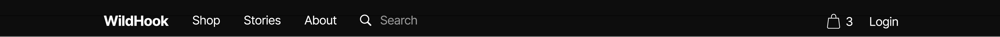

# WildHook
 
Welcome to WildHook, where the thrill of fishing meets the untamed spirit of the great outdoors. We are your premier destination for top-quality fishing tackle and accessories, designed to elevate your angling experience to new heights.

At WildHook, we understand that fishing isn't just a hobby; it's a passion, a way of life. Whether you're an experienced angler seeking the perfect catch or a beginner eager to explore the world of fishing, our brand is here to accompany you on your journey.

Our Vision:
WildHook was born from a love for fishing and a deep appreciation for the wild, rugged landscapes of Ireland and the UK. Our vision is simple yet powerful – to provide you with the tools and knowledge you need to make every fishing trip an unforgettable adventure.

## Table of contents
  * [Overview](#overview)
  * [UX](#ux)
    + [Brand Guidelines](#brand-guidelines)
    + [Scope](#scope)
    + [Structure](#structure)
    + [Skeleton](#skeleton)
    + [Design ](#design)
      - [Color Scheme](#color-scheme)
      - [Fonts](#fonts)
      - [Other](#other)
  * [Agile](#agile)
  * [Features](#features)
    + [Existing Features](#existing-features)
      - [Menu](#menu)
      - [About](#about)
      - [Accounts](#accounts)
      - [Bookings](#bookings)
      - [Booking Managment](#booking-management)
    + [Future Feature Considerations](#future-feature-considerations)
  * [Responsive Layout and Design](#responsive-layout-and-design)
  * [Tools Used](#tools-used)
    + [Python packages](#python-packages)
  * [Testing](#testing)
  * [Deployment](#deployment)
    + [Deploy on heroku](#deploy-on-heroku)
  * [Credits](#credits)
    + [Content](#content)
    + [Media](#media)
    + [Code](#code)
  * [Acknowledgements](#acknowledgements)

## Overview
WildHook is an ambitious online platform dedicated to passionate fishing enthusiasts in Ireland and the UK. Combining an intuitive e-commerce interface with rich educational content, we aim to provide a one-stop hub for all things fishing. Users can browse and purchase quality fishing gear, access informative guides and tips, engage with a vibrant fishing community, and streamline their experiences through personalized accounts. With a focus on responsive design and user engagement, WildHook aspires to redefine the online fishing experience, catering to both novice and experienced anglers.
In order to achieve this WildHook has been developed using Python (Django), HTML, CSS and JavaScript PostgreSQL database.
  
The deployed project can be accessed at [here]().  

## User Stories 
 

|                Sprint              | Number |        User Story          |
| :------------------------------:|---|:-------------------------------------------: |
| **Sprint-1**                               || |
|                                       | #1 | Set Up WildHook Repository - As a Dev I can Use GitHub so that have version control |             
|                                       | #2 | Set up development IDE - As a Dev I can set up an IDE so that the project can be created in a functional workspace|
|                                       |#3| Initialise the project - As a Dev I can initialise the project so that organise the file structure and being building out the app and features|
|                                       |#4| Create & Add Database - As a Dev I can Add a database so that I can store essential Data and access it as required|
|                                       |#5| Create Template, Static & Media directories - As a Dev I can Add directories so that My templates, images and styling is accessible and connected to the app |
|                                       |#6|Test Deployment - As a Dev I can Deploy the project so that I can view and test the project as a user would throughout the project| 
|                                       |#7| Authentication - As a dev I can Install authentication packages so that I can ensure that access is controlled |
|                                       |#8| Bootstrap - As a Dev I can Use tools like bootstrap so that I can manage my time efficiently and create functional web apps with good UI/UX | 
|                                       |#9| Base template - As a Dev I can Create a base template so that I can extend from to prevent verbose code, increase efficiency and have consistent UX/UI |
|**Sprint-2**                        | |  |
|                                       |#10| Home Page - As a dev I can create a home page so that users can land on a page, see their options and choose where they want to navigate to| 
|                                       |#11| Product set up - As a user I can see products so that can order the ones I want|
|                                       |#12|Product Filtering, Sorting and Searching - As a user I can Filter, Sort and Search so that find specific products or categories |
|                                       |#13| Shopping Cart - As a User I can create a cart to save multiple products in while I shop so that I can view, add and update different products | 
|                                       |#14| Updating the Cart - As a user I can adjust the cart so that I can update add or takeaway products from the cart |
|**Sprint-3**                        | |  |
|                                       |#15| Checkout - As a user I can use a checkout feature so that I can pay securely and safely for my products |
|                                       |#16| Integrate Stripe - As a Owner I can integrate stripe so that payments can be managed automatically and securely |
|                                       |#17| Profiles - As a User/Owner/Dev I can Sign in to my account so that access a relevant amount of information for my access |
|                                       |#18| Product Management - As a Owner I can Create, Update and Delete Products so that manage my store effectively |
|**Sprint-4**                        | |  |
|                                       |#19| Stripe Account set-up - As a Dev/Owner I can create a Stripe account so that I can manage online payments |
|                                       |#20| Stripe Integration - As a Dev I can integrate stripe so that secure payments can be taken |
|                                       |#21| Checkout Styling - As a Dev I can edit and Update stripes standard payment gateway so that secure payments are processed, with a UI/UX inline with the brands guidelines |
|                                       |#22| Checkout testing - As a Dev I can test the checkout so that i can confirm that secure payments are being processed |
|                                       |#23| Project review - As a Dev I can review the project so that I can ensure all the features are satisfactory and the UX/UI is to requirements. Add any new features that may have been added with the Agile approach, plan and implement them. |
|**Sprint-5**                     | | TBC |
|                                       ||  |

**Goal:** 
 
WildHook was born from a love for fishing and a deep appreciation for the wild, rugged landscapes of Ireland and the UK. Our vision is simple yet powerful – to provide you with the tools and knowledge you need to make every fishing trip an unforgettable adventure.

  

### Objectives 

- **Elevate User Experience:**
  - Ensure an intuitive, engaging, and informative browsing experience for all users, enhancing satisfaction and encouraging return visits.

- **Drive Product Sales:**
  - Facilitate easy product discovery, seamless transactions, and targeted promotions to boost sales of fishing gear and accessories.

- **Educational Resource Hub:**
  - Establish the website as a go-to educational platform for fishing, offering a wide array of guides, tutorials, and tips for all skill levels.

- **Foster a Community:**
  - Build a vibrant and interactive community where fishing enthusiasts can connect, share experiences, and support each other's angling journeys.

- **Enhance Brand Awareness:**
  - Showcase the WildHook brand, its values, and its commitment to quality fishing gear, establishing trust and credibility among the audience.

- **Enable Customer Engagement:**
  - Encourage users to actively engage with the website, contribute content, and participate in discussions, fostering a sense of belonging and loyalty.

- **Optimize for Mobile Accessibility:**
  - Ensure the website is fully responsive and accessible on various devices, meeting the needs of the mobile-centric user base.

- **Capture Customer Data and Insights:**
  - Implement strategies to capture user data, behavior, and preferences, allowing for personalized experiences, targeted marketing, and informed decision-making.

 

## Scope
 

**E-commerce Functionality:**
   - An online platform for customers to browse, select, and purchase fishing tackle, gear, and related accessories.

**Content Hub:**
   - A comprehensive collection of educational content, including guides, tips, articles, and videos related to fishing.

**Community Engagement:**
   - A community forum or section for users to share experiences, ask questions, and engage with fellow fishing enthusiasts.

**Account Management:**
   - User accounts allowing customers to create profiles, manage preferences, view order history, and track shipments.

**Product Catalog Management:**
   - An easy-to-use system for managing and updating the product catalog, including adding new items, modifying existing ones, and managing inventory.

**Newsletter and Email Integration:**
   - Integration with a newsletter system to manage subscriptions and send out regular updates, promotions, and announcements to customers.

**Responsive Design:**
   - A website designed to adapt seamlessly to various devices and screen sizes, ensuring a consistent and user-friendly experience across platforms.

## User Experience
 

- **Intuitive Navigation:**
  - Clear and simple navigation menus enabling users to easily find products, categories, and essential information about fishing.

- **Visual Appeal:**
  - Engaging visuals, including high-quality images and graphics showcasing products, the outdoors, and the fishing experience to captivate and inspire visitors.

- **Personalized Product Recommendations:**
  - Utilization of user behavior and preferences to offer personalized product recommendations, enhancing the shopping experience.

- **Informative and Educational Content:**
  - Integration of informative blog posts, guides, and video content to educate users about fishing techniques, equipment, and trends, establishing the brand as a valuable knowledge resource.

- **Smooth Checkout Process:**
  - Streamlined and user-friendly checkout process with clear steps, secure payment options, and order tracking to ensure a seamless shopping journey.

- **Responsive Design:**
  - A responsive design ensuring the website functions flawlessly across various devices and screen sizes, providing a consistent user experience.

- **Interactive Community Engagement:**
  - Integration of social features, forums, or a community space for anglers to interact, share experiences, and provide recommendations, fostering a sense of belonging and enhancing the overall user experience.

## User Interface

### Customer Journey 
#### User Journey for First-Time Customers:

**Homepage:**
   - First-time customers land on the WildHook homepage, greeted with an attractive layout featuring striking visuals of fishing gear, outdoor scenes, and a clear call-to-action to begin exploring.

**Browse Products:**
   - They navigate to the "Products" section, where they can easily browse through the product catalog, filter by categories, and access detailed descriptions and images of fishing tackle and accessories.

**Discover Guides and Tips:**
   - Curious about fishing techniques and tips, they visit the "Guides" section to discover a variety of fishing guides, tips, and tutorials catering to different skill levels and fishing environments.

**Brand Story and Values:**
   - Intrigued by the brand, they read the "About Us" page to learn about WildHook's brand story, mission, and commitment to providing quality fishing gear, establishing trust and confidence in the brand.

**Register/Sign Up:**
   - They proceed to sign up for an account, providing necessary details to streamline their future shopping experiences and receive updates on promotions and new product launches.

**Product Selection and Cart:**
   - After exploring, they select desired products, add them to their cart, and proceed to the checkout, where they provide shipping and payment details.

**Checkout and Confirmation:**
   - They complete the purchase, receiving an order confirmation email and tracking information to monitor their shipment.

#### User Journey for Repeat Customers:

**Login:**
   - Repeat customers begin their journey by logging into their account, providing a seamless and personalized experience.

**Homepage Customization:**
   - Upon login, they are directed to a personalized homepage displaying recommended products based on their past purchases and browsing history.

**Quick Reorder or Browse:**
   - They have the option to quickly reorder previous purchases or browse new products based on their interests.

**Explore New Arrivals or Promotions:**
   - Interested in exploring what's new, they navigate to the "New Arrivals" or "Promotions" section to take advantage of the latest products or deals.

**Community Engagement:**
   - Engaging with the community, they contribute by sharing their fishing experiences, providing product reviews, or participating in forum discussions.

**Track Orders:**
   - For recent purchases, they track their orders and receive updates on the status and expected delivery.

**Profile and Account Management:**
   - They can easily update their profile, manage payment methods, and modify their preferences to enhance their user experience for future visits.

## Content Strategy
 

- **Product Catalog and Descriptions:**
  - Detailed descriptions and specifications of fishing tackle and accessories, aiding customers in making informed purchase decisions.

- **Fishing Guides and Tips:**
  - Comprehensive guides, tips, and tutorials on various fishing techniques, locations, and best practices, enhancing the value of the website for fishing enthusiasts.

- **Brand Story and Values:**
  - A compelling narrative about the brand's origin, mission, and commitment to providing high-quality fishing gear, establishing trust and connection with the audience.

- **Customer Reviews and Testimonials:**
  - Real-life testimonials and reviews from satisfied customers, instilling confidence in potential buyers and showcasing the brand's credibility.

- **Blog Posts and Articles:**
  - Engaging and informative blog posts covering a range of topics related to fishing, outdoor adventures, gear reviews, and industry updates, attracting and educating a broader audience.

- **Seasonal Promotions and Deals:**
  - Regularly updated promotions, discounts, and special deals on fishing products, encouraging visitors to make purchases and explore new gear.

- **Community-Generated Content:**
  - User-generated content such as fishing stories, images, and videos shared by the community, fostering a sense of community engagement and strengthening the brand's online presence.

## Features
 

- **Product Catalog and Descriptions:**
  - Detailed descriptions and specifications of fishing tackle and accessories, aiding customers in making informed purchase decisions.

- **Fishing Guides and Tips:**
  - Comprehensive guides, tips, and tutorials on various fishing techniques, locations, and best practices, enhancing the value of the website for fishing enthusiasts.

- **Brand Story and Values:**
  - A compelling narrative about the brand's origin, mission, and commitment to providing high-quality fishing gear, establishing trust and connection with the audience.

- **Customer Reviews and Testimonials:**
  - Real-life testimonials and reviews from satisfied customers, instilling confidence in potential buyers and showcasing the brand's credibility.

- **Blog Posts and Articles:**
  - Engaging and informative blog posts covering a range of topics related to fishing, outdoor adventures, gear reviews, and industry updates, attracting and educating a broader audience.

- **Seasonal Promotions and Deals:**
  - Regularly updated promotions, discounts, and special deals on fishing products, encouraging visitors to make purchases and explore new gear.

- **Community-Generated Content:**
  - User-generated content such as fishing stories, images, and videos shared by the community, fostering a sense of community engagement and strengthening the brand's online presence.

## Account types 
 

- **Customer Accounts:**
  - Standard user accounts for visitors and customers allowing them to browse products, make purchases, view order history, and manage their profiles.

- **Administrator Accounts:**
  - High-level accounts for website administrators with full access and control over the website's functionality, including content management, user management, and website configuration.

- **Developer Accounts:**
  - Accounts for developers responsible for maintaining and updating the website, managing codebase, resolving technical issues, and implementing new features and functionalities.

## Responsive Design
 
The WildHook website prioritizes a responsive design approach, ensuring optimal functionality and aesthetics across various devices and screen sizes. Employing flexible layouts and grids, the site seamlessly adapts, providing an exceptional user experience on desktops, tablets, and smartphones. Key elements like navigation menus, images, and content are optimized, guaranteeing clarity and accessibility regardless of the device. Media queries and fluid grids are utilized to adjust content proportionally, maintaining a cohesive and visually pleasing layout. By embracing responsive design principles, WildHook aims to engage users effectively, regardless of their preferred device, delivering a consistent and enjoyable browsing journey.

  

## Structure
 

### Site Structure for the WildHook Website:

**Home:**
   - Landing page featuring an overview of WildHook, showcasing featured products, guides, and engaging visuals.

**Products:**
   - Section containing the product catalog categorized by type, brand, or fishing technique, allowing users to browse and filter based on their preferences.

**Guides and Tips:**
   - Dedicated section presenting fishing guides, tutorials, tips, and informative articles to educate and assist users in their fishing endeavors.

**Community:**
   - Community forum or platform for users to engage, share experiences, ask questions, and contribute to the fishing community.

**About Us:**
   - Page providing information about WildHook, its brand story, mission, values, and the team behind the brand.

**Account:**
   - User account management section enabling registration, login, profile editing, order history, and preferences management.

**Contact Us:**
   - Page featuring contact information, a contact form, and a map for users to get in touch with WildHook for inquiries and support.

#### FLOWCHART
The Flowchart  XYZ
 

  

### Skeleton

## Wireframes
 

Wire frames have been created using [Figma](https://www.figma.com/)

 
  
Home Page
 
  

 
  
Header
 
  

 
  
Footer
 
  

 
  
Latest Arrivals
 
  

 
  
Products
 
  

 
  
Product Sorting
 
  

 
  
Product Detail
 
  

 
  
Add a Product to the Cart
 
  

 
  
Shopping Cart
 
  

 
  
Checkout
 
  

 
  
Shipping Information
 
  

 
  
Payment Details
 
  

 
  
Reviews
 
  

 
  
Email Login
 
  

 
  
Social Login
 
  

 

**Database**
 
Initial Schema
 make drop down

 

Final Schema
 make drop down
 

## Design 

### Brand Guidelines

## Personality
- Reflect the rugged, wild, and adventurous personality of the brand.
- Maintain a casual and relaxed tone.
- Foster a knowledgeable and fun environment for fishing enthusiasts.

## Audience
- The brand caters to a diverse audience of fishing enthusiasts, ranging from beginners to seasoned anglers in the Island of Ireland and the UK.

## Geographic Focus
- Highlight the Irish and UK geographic focus by subtly incorporating elements that evoke the landscapes of Ireland.

## Adventure Theme
- Infuse the logo with elements that convey the thrill and adventure associated with fishing, whether it's in the great outdoors or the open water.

## Color Scheme
### Primary Colors
- **Deep Forest Green (#00563F)**: Symbolizing the lush, green landscapes of Ireland and the natural essence of the brand.
- **Slate Gray (#47525E)**: Providing a neutral, stable base that complements the primary green.

### Accent Colors
- **Earthy Brown (#8B5A2B)**: Adding an earthy tone, connecting with the outdoor and adventurous theme.
- **Yale Blue (#0D3D6D)**: Infusing vibrancy, representing the aquatic environment of fishing.
- **Gold Accent (#DAA520)**: Adding a touch of premium quality and sophistication.

#### Fonts
**Heading and Titles:**
 

**Font Family:** Montserrat
   - **Description:** Montserrat is a modern, elegant font ideal for headings and titles, providing a clean and sleek look for a contemporary design.

**Body Text and Buttons:**
 

**Font Family:** Lato
   - **Description:** Lato is a highly legible and versatile font suitable for both body text and buttons. Its neutrality and clarity ensure readability across various screen sizes while maintaining a cohesive look.

#### Other

## Agile
This project was developed using the Agile methodology.
 
User stories where created in GitHub issues, labeled and added to milestones as iterations. Each iteration contained a Kanban board which contained **To Do**, **In-Progress** and **Done**. 

### Sprint Details

* **Sprint 1**

     

* **Sprint 2**
   

  

* **Sprint 3**
    
* **Sprint 4**  
    

## Features
### Existing Features
#### Home Page
#### About
#### Products
#### Product Detail
#### Checkout

### Future Feature Considerations

#### Preorder

## Responsive Layout and Design
Bootsrtap

**Tested devices:**
 - Iphone etc etc

## Tools Used

[GitHub](https://github.com/) - Hosting code
 

[Git](https://git-scm.com/) - Version control
 

[GitPod](https://www.gitpod.io/) - Code editor
 

[Heroku](https://dashboard.heroku.com/) - Project deployment
 

[Favicon.io](https://favicon.io/) - Website favicon
 

[Grammarly](https://app.grammarly.com/) - Spelling/Grammer checks
 

[Font Awesome](https://fontawesome.com/) - Icons/Buttons
 

[Bootstrap](https://getbootstrap.com/) - Front-end toolkit
 

[Google Fonts](https://fonts.google.com/) - Fonts
 

[PEP8 Validator](http://pep8online.com/) - Validating Python
 

[JsHint](https://jshint.com/) - Validating JavaScript
 

[HTML W3C Validator](https://validator.w3.org/) - used for validating the HTML
 

[CSS W3C Validator](https://jigsaw.w3.org/css-validator/) - used for validating the CSS
 

[Chrome Dev Tools](https://developer.chrome.com/docs/devtools/) - for debugging the project
 

LightHouse - Proformance testing
 

### Python packages

* django 
* gunicorn 
* dj-database-url
* psycopg2
* django-allauth
* django-crispy-forms

## Testing
The testing documentation can be found at [TESTING.md](TESTING.md)

## Deployment

### Deploy on Heroku

## Credits
### Content

### Media
Stock images where downloaded from .
 
The home page background image was downloaded from 

Licencing for using XXX images can be found [here](https://www..com/license/) and has been adhered to across the site

### Code

## Acknowledgements